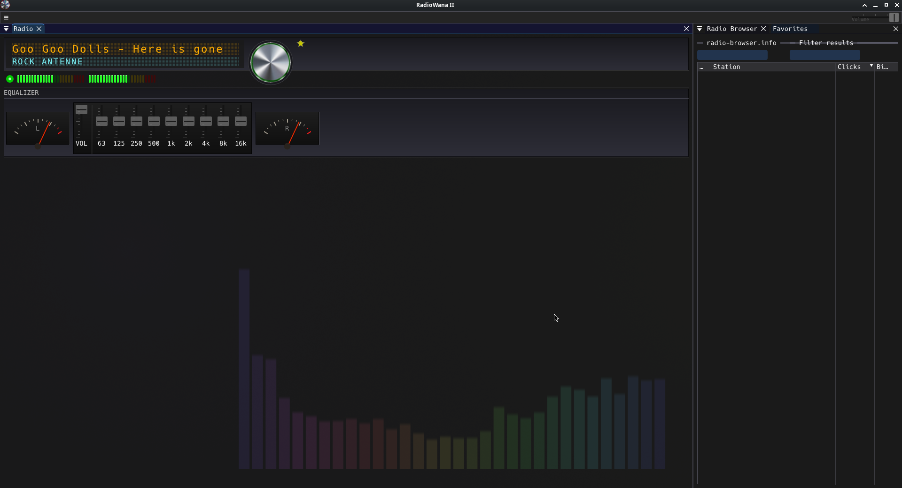
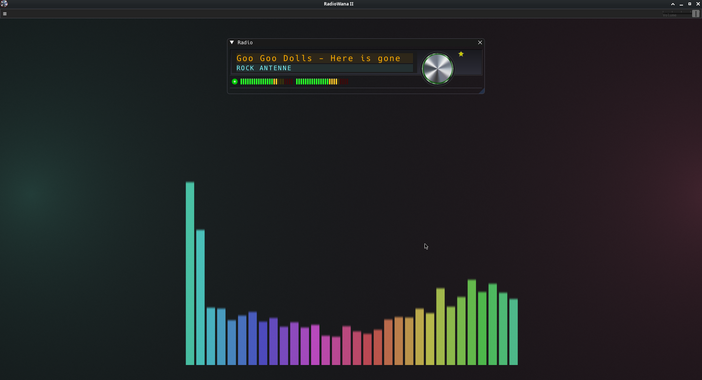
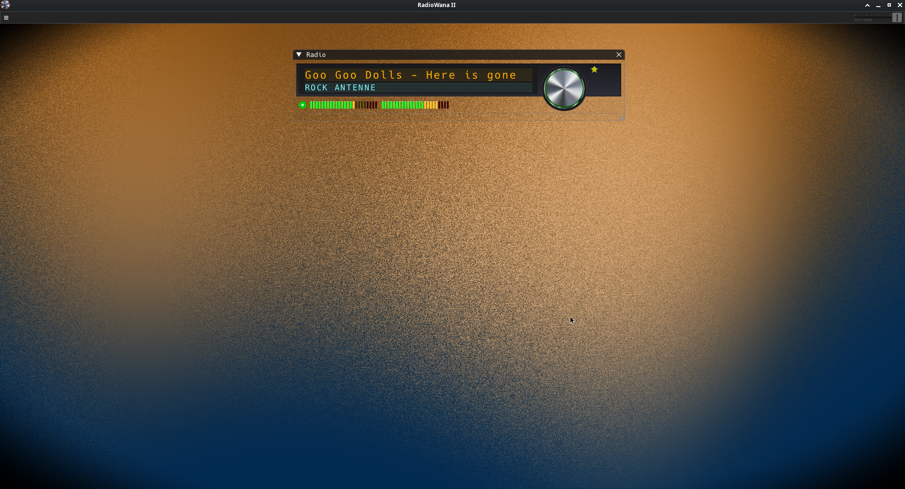

# RadioWana II

## Status: Desktop Version 0.260402

A cross platform Internet Radio. 

--- 

In this Project I use: 

- Framework: [OhmFlux](https://github.com/ohmtal/OhmFlux)
- Backend: [SDL3](https://www.libsdl.org/)
- Gui: [Dear ImGui](https://github.com/ocornut/imgui)
- Https handling: [libCurl](https://curl.se/libcurl/)
- MP3 Decoder: [miniaudio](https://github.com/mackron/miniaudio)
- Development
    - IDE/Text: [KDevelop](https://kdevelop.org/), [Kate](https://apps.kde.org/kate/)
    - Devel/Testing OS: [Arch Linux](https://archlinux.org/), [FreeBSD](https://freebsd.org/)

- Database [RadioBrowser](https://www.radio-browser.info/)
    

Limitation: 
- Only MP3 streams.
- Android Build only support HTTP not HTTPS

---

## Screenshots

